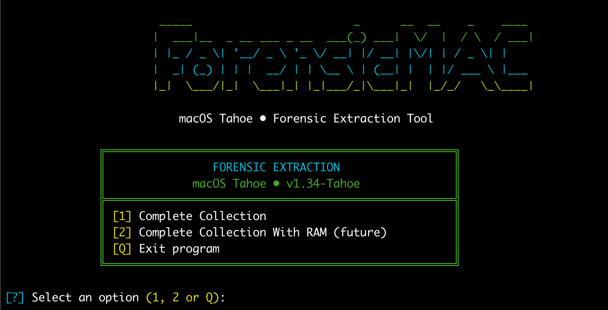

# Forensic Extraction (macOS Tahoe)

**Bash** tool for **forensic collection and triage** from the terminal on **macOS Tahoe (v26)** (**must always be run with `sudo`**; see [Requirements](#-requirements)): colored interface, menus, execution of **native commands** (operational table), output in **`RESULTS/`** (one `.txt` per command where applicable), and **integrity check** at closure (**`shasum -a 256`**, size, **`mtime`** (Unix epoch), relative path, stable order, and auditable header in **`01_INTEGRITY_CHECK.txt`**). **Optional:** manifest signature with **`openssl dgst`** (native on macOS) → **`01_INTEGRITY_CHECK.txt.sig`** if you set **`FORENSIC_OPENSSL_SIGN_KEY`**. Physical RAM dump with **osxpmem** is not included (external tool). **No** `.tgz` file of the session is generated (the evidence stays in the session folder).

**Current script version:** see the `VERSION` variable at the start of `Forensic-MAC.sh` (currently **1.34-Tahoe**; optimized for macOS 26.5.2 with Apple Silicon/Intel architecture detection).

---

## Table of contents

1. [Legal notice and usage](#-legal-notice-and-usage)
2. [Requirements](#-requirements)
3. [Installation and execution](#-installation-and-execution)
4. [Menu behavior](#-menu-behavior)
5. [Operational table (first delivery)](#-operational-table-first-delivery)
   - [Installed software](#installed-software)
   - [Login items and Launch* persistence](#login-items-and-launch-persistence)
   - [TCC (SQLite databases and chain of evidence)](#-tcc-sqlite-databases-and-chain-of-evidence)
   - [Browser history (SQLite)](#-browser-history-sqlite-on-disk)
6. [Code structure (`Forensic-MAC.sh`)](#-code-structure-forensic-macsh)
7. [Color palette](#-color-palette)
8. [`RESULTS/` folder](#-results-folder)
9. [Output and evidence (future expansion)](#-output-and-evidence-future-expansion)
10. [Terminal compatibility](#-terminal-compatibility)
11. [Troubleshooting & FAQ](#-troubleshooting--faq)
12. [Project status, roadmap, and future backlog](#-project-status-roadmap-and-future-backlog)
13. [How to extend the script](#-how-to-extend-the-script)

---

## ⚠️ Legal notice and usage

- Use it **only with explicit authorization** and according to your organization's policies.
- Chain of custody, evidence integrity, and legal procedures are **not replaced** by this repository.
- RAM dumping and access to system artifacts may require **elevated privileges** and leave traces; the script **does not attempt to evade** macOS controls.

---

## ✅ Requirements

| Requirement | Detail |
|-----------|---------|
| System | **macOS Tahoe (v26)** or later. Compatible with **Apple Silicon** (M1/M2/M3/M4) and **Intel**. Development and testing target the latest versions; compatibility with old hardware or systems is not pursued. |
| Shell | `bash` (the historic default on macOS; the script does not depend on `zsh`) |
| Terminal | Recommended: a terminal that supports **ANSI truecolor** (24-bit) for the RGB values defined in the script |
| Administrator | You must launch the script **always with `sudo`** (once; mandatory). macOS only asks for the password **at startup**; the script uses `sudo -u <user>` internally only to run the per-user login-items check, which doesn't prompt again since the process already runs as root. Use **`sudo -E`** if you need to **preserve environment variables** (e.g. `FORENSIC_OPENSSL_SIGN_KEY` for the OpenSSL signature **or** optional browser-history options like **`FORENSIC_BROWSER_HISTORY_EXPORT_TABLES`**; see "Installation and execution"). |

---

## ▶️ Installation and execution

No external dependencies (only Bash and typical utilities: `tput`, `clear`). **`openssl`** ships with macOS and is only used if you enable the manifest signature (below).

**OpenSSL manifest signature (optional):** export the path to a **private PEM key** (RSA or EC). For the **`FORENSIC_OPENSSL_SIGN_KEY`** variable to reach the script, use **`sudo -E`**:

```bash
export FORENSIC_OPENSSL_SIGN_KEY="/secure/path/key.pem"
sudo -E bash "/path/to/project/Forensic-MAC.sh"
```

After generating `01_INTEGRITY_CHECK.txt`, **`01_INTEGRITY_CHECK.txt.sig`** is created (`openssl dgst -sha256 -sign …`). Without the variable or a readable key, it is not signed. To **verify** (with the public key in PEM):

```bash
openssl dgst -sha256 -verify public.pem -signature 01_INTEGRITY_CHECK.txt.sig 01_INTEGRITY_CHECK.txt
```

Extract `public.pem` from the private key: `openssl rsa -in key.pem -pubout -out public.pem` (RSA) or `openssl ec -in key.pem -pubout -out public.pem` (EC).

The whole process runs as root from the start, so **no** individual extraction command needs `sudo` prepended.

**Run** (recommended):

```bash
sudo bash "/path/to/project/Forensic-MAC.sh"
```

**Run as an executable**:

```bash
chmod +x "/path/to/project/Forensic-MAC.sh"
sudo "/path/to/project/Forensic-MAC.sh"
```

From the project folder:

```bash
cd "/path/to/project/Forensic-MAC"
sudo bash ./Forensic-MAC.sh
```

**Optional (**v1.31+**) — CSV history samples from the session copies:**

```bash
export FORENSIC_BROWSER_HISTORY_EXPORT_TABLES=1
export FORENSIC_BROWSER_HISTORY_SQL_LIMIT=8000   # optional
sudo -E bash "./Forensic-MAC.sh"
```

The selected tables and the limit are documented in `evidence/browser_history/documentation/` when the collection runs.

---

## 🎬 Usage example



The script launches with a **Figlet ASCII art banner** and a **colored menu** (green frame, blue titles, yellow option keys). Select **[1]** to run a complete collection, **[2]** for future RAM-dump mode, or **[Q]** to exit.

---

## 🧭 Menu behavior

### Menu (single)

| Key | Action |
|-------|--------|
| **1** | **Without RAM**: **100% complete** extraction — the whole collection in **`evidence/`** without the native volatile block (`vm_stat` / `sysctl`). Integrity listing (`01_INTEGRITY_CHECK.txt`). |
| **2** | **With RAM**: for now only shows a **"FUTURE MODE"** box ("Implementation in development...") and returns to the menu (no collection). The actual implementation is planned for a later version; the code still has `forensic_extraction_volatile_ram_native` and the `complete_with_ram` mode ready to be reattached. |
| **Q** | Exits the program with a farewell message. |

Any other input shows an error, a separator, and asks for ENTER before refreshing.

After **1**, the script runs the collection (can take a long time: `log collect`, `system_profiler SPApplicationsDataType`, `rsync` of Launch* and temp files, etc.), shows the session path, waits for ENTER, and clears the screen before returning to the menu. After **2**, only the future-implementation message and ENTER.

During collection you'll see **`[·]`** lines on the console indicating **which command or copy is running** and the output file (or the `rsync`); there is **no** progress percentage, just information.

---

## 📋 Operational table (first delivery)

Coverage aligned with the originally defined table; **only native macOS binaries**. Adjustments relative to the original table:

| Original row | In the script |
|---------|----------------|
| Context (`date`, `whoami`, `hostname`) | ✅ One `.txt` per command (+ `uname -a`, `sw_vers`). |
| `system_profiler` HW/SW | ✅ |
| Users (`dscl`, `last`, `who`) | ✅ + `dscacheutil -q user` (complete). |
| Processes (`ps`, `top`) | ✅ `ps auxww`, `top -l 1`. |
| Network (connectivity, DNS, routes, and local proxy) | ✅ `netstat -an/-rn`, `lsof -i`, `ifconfig`, **`scutil --dns`**, **`scutil --proxy`** (**v1.31+**), **`scutil --nc list`** (VPN; **v1.31+**), `arp`, `route get default`, **`networksetup -listallnetworkservices`** / **`listallhardwareports`** (**v1.31+**), **`dscacheutil -statistics`**, **`/etc/hosts`** contents (**v1.31+**) — see prefix `evidence/network_*`. |
| **Wi‑Fi / Thunderbolt (profile)** | ✅ **`system_profiler SPAirPortDataType SPThunderboltDataType`** (**v1.31+**) → `evidence/hardware_system_profiler_SPAirPort_SPThunderbolt.txt`. |
| `log collect` | ✅ Output in `evidence/logs_collect.logarchive` + command log. |
| RAM / **osxpmem** | ❌ Not native → a note + `vm_stat` / `sysctl` exist in code for the **complete_with_ram** branch (today menu option **[2]** does not run it). |
| Disks and volumes (listing) | ✅ `diskutil list`, `diskutil apfs list`, `mount` — see prefix `evidence/disk_*`. |
| Disk / volume acquisition (imaging) | ❌ **Not** included: no `hdiutil`, `SPStorageDataType`, nor full `/Users/` copy with `rsync` (`mirror_Users`). Only the listing commands above are collected, not a disk image. |
| Launch* Persistence | ✅ `rsync` of `LaunchDaemons` / `LaunchAgents` (system and Library) + **`ls -la`** on `/Library/…` and per user in `~/Library/LaunchAgents` + **`osascript` login items** (complete mode; see next section). |
| **TCC** (`TCC.db` SQLite in system and accounts) | ✅ **Complete mode only** → **`evidence/TCC/`** (**v1.29+**): copies with `cp -p` from typical macOS paths, **`documentation/`** subfolder (`README_PROCEDURE.txt`, `sqlite3_version.txt`, `copy_log.txt`), **`sqlite_metadata/`** with `.schema`, `integrity_check`, and `page_count` via **`sqlite3` on the copies** (not on the live source beyond the `cp`). SIP or permissions may block sources; see detail in the [TCC section](#-tcc-sqlite-databases-and-chain-of-evidence). |
| **Extensions / kext / PluginKit** | ✅ **Complete mode only** → **v1.30+** native addition alongside **`systemextensionsctl list`**: `system_profiler SPExtensionsDataType`, `kextstat`, `pluginkit -m Av`, `ls -la` of `/Library/Extensions`, `/Library/SystemExtensions`, `/System/Library/Extensions`, `kmutil showlists`, `kmutil showloaded` (see prefix `evidence/security_`). |
| **Browser history** | ✅ **`evidence/browser_history/`**: `cp -p` copies (**v1.30+**) and PRAGMA metadata; more Chromium-like browsers (**Opera**, **Opera GX**, **Yandex**, **Chromium**) **v1.31+**. **Optional** (`FORENSIC_BROWSER_HISTORY_EXPORT_TABLES=1` + **`sudo -E`**): CSV samples (`export_sql/`). Detail in [browser history](#-browser-history-sqlite-on-disk). |
| `/tmp`, `/var/tmp` | ✅ |
| `shasum -a 256` | ✅ `01_INTEGRITY_CHECK.txt` at the end: header (version, `SESSION_ROOT`, count, algorithm, date) + `SHA256 bytes mtime_epoch relative_path` lines in lexicographic order (`LC_ALL=C`). **Optional:** `openssl` → `01_INTEGRITY_CHECK.txt.sig` if `FORENSIC_OPENSSL_SIGN_KEY`. |
| `tar` / `.tgz` packaging | ❌ **Not** generated; output stays only in the session folder. |

### Installed software

Aligned with the **installed software** table; on disk `ls -la` is used (more forensically useful than plain `ls`). Everything under **`evidence/`** (includes `SPApplicationsDataType`, slow).

| Objective | Reference command | In the script |
|----------|----------------------|--------------|
| Global app listing | `ls /Applications` | ✅ `evidence/software_ls_Applications.txt` |
| Apps per user (`~/Applications`) | `ls ~/Applications` | ✅ **Complete mode** → `evidence/software_ls_Users_Applications.txt`: walks `/Users/*/Applications` and `/var/root/Applications` (with `sudo`, `~` would just be root; this way every account is covered). |
| App detail | `system_profiler SPApplicationsDataType` | ✅ **Complete mode only** → `evidence/software_system_profiler_SPApplicationsDataType.txt` (can be **very slow** and large). |
| Installed `.pkg` packages | `pkgutil --pkgs` | ✅ `evidence/software_pkgutil_pkgs.txt` |

### Login items and Launch persistence

**Login Items** / persistence table. On disk **`ls -la`** is used where the reference was just `ls`.

| Objective | Reference command | In the script |
|----------|----------------------|--------------|
| Login-session apps (GUI) | `osascript -e 'tell application "System Events" to get the name of every login item'` | ✅ **Complete mode only** → `evidence/loginitems_osascript_System_Events.txt`: for each user under `/Users/*` (except `Shared`), runs `sudo -u <user> osascript …`; at the end, a reference line as **root**. May **fail or return empty** due to **TCC** (Automation of *Terminal* or *bash* toward **System Events**) or no graphical console; check stderr in the `.txt`. |
| User `LaunchAgents` | `ls ~/Library/LaunchAgents` | ✅ `evidence/persistence_ls_Users_Library_LaunchAgents.txt` (`/Users/*/Library/LaunchAgents` and `/var/root/…`). |
| System `LaunchAgents` | `ls /Library/LaunchAgents` | ✅ `evidence/persistence_ls_Library_LaunchAgents.txt` |
| `LaunchDaemons` (root / boot) | `ls /Library/LaunchDaemons` | ✅ `evidence/persistence_ls_Library_LaunchDaemons.txt` |

In addition, under **`evidence/`** the **`rsync`** copies remain in `evidence/persistence/` (as before).

### TCC (SQLite databases and chain of evidence)

The **Transparency, Consent, and Control** database (`TCC.db`) is **SQLite**. In mode **[1]** (complete collection without RAM), **after** the **`spctl` / `csrutil` / extensions** block (`systemextensionsctl list` and v1.30+ additions; `kmutil`) and **before** the **`ls`** listing of typical browser paths, the script runs **`forensic_acquisition_tcc`**, which creates in the session:

| Folder / relative file | Content |
|----------------------------|-----------|
| **`evidence/TCC/documentation/README_PROCEDURE.txt`** | Fixed text describing the folder's purpose, evidentiary value against the integrity manifest (`01_INTEGRITY_CHECK.txt`), and limitations (SIP, permissions). |
| **`evidence/TCC/documentation/sqlite3_version.txt`** | Output of `sqlite3 --version` (or a notice if `sqlite3` is missing). |
| **`evidence/TCC/documentation/copy_log.txt`** | Header with date + one line per `cp` attempt: success, failure (`cp` couldn't copy; exit code), or skip (file missing or not visible). |
| **`evidence/TCC/source_system/`** | Copy of `/Library/Application Support/com.apple.TCC/TCC.db` if it exists and **`cp -p`** succeeds. |
| **`evidence/TCC/source_user_<sanitized_name>/`** | One subfolder per user in `/Users/*` (except `Shared`): copy of `~/Library/Application Support/com.apple.TCC/TCC.db` if it exists. |
| **`evidence/TCC/source_var_root/`** | Copy of `/var/root/Library/Application Support/com.apple.TCC/TCC.db` if it exists. |
| **`evidence/TCC/sqlite_metadata/`** | For each valid copy on disk: files with a prefix matching the source — **`.schema.txt`**, **`.integrity_check.txt`**, **`.pragma_page_count.txt`** (`sqlite3` on the **local copy**, no direct queries against the source beyond the `cp`). |

**Operational notes:** **SIP** and **Full Disk Access** policies may prevent reading or copying the system `TCC.db`; the log reflects real attempts. The SQL schema may vary between macOS versions. The integrity of the whole session is still documented with **`00_METADATA.txt`** and **`01_INTEGRITY_CHECK.txt`** (this folder is included in the manifest if the phase ran **before** closing).

### Browser history (SQLite on disk)

After **`forensic_ls_browser_paths_preview`** (only folder `ls`), **`forensic_acquisition_browser_history`** attempts **`cp -p`** on typical SQLite databases and dumps **`sqlite3`** (`.schema`, `PRAGMA`) **only on the copies**. **v1.31+:** more Chromium sources (Opera, Opera GX, Yandex, Chromium); **optional CSV export** of history tables if you set the environment variables before **`sudo -E`** (see [Installation and execution](#-installation-and-execution)).

| Folder / relative file | Content |
|----------------------------|-----------|
| **`evidence/browser_history/documentation/README_PROCEDURE.txt`** | Procedure and limits (WAL, browser in use, data volume). |
| **`evidence/browser_history/documentation/FORENSIC_BROWSER_HISTORY_EXPORT_TABLES.txt`** | **v1.31+** Instructions for the optional tabular export. |
| **`evidence/browser_history/documentation/sqlite3_version.txt`** | `sqlite3 --version` or a notice. |
| **`evidence/browser_history/documentation/copy_log.txt`** | One line per copy attempt (success / failure / skip). |
| **`evidence/browser_history/copy_user_*`** (incl. `copy_user_var_root` for `/var/root`) | **Safari** `History.db` (legacy and container). **Chromium-like** (`User Data/…/History`): Chrome, Brave, Edge, Vivaldi, Arc, Opera, Opera GX, Yandex, Chromium. **Firefox** `places.sqlite`. **`/var/root`:** only Safari, Chrome, and Opera are attempted. |
| **`evidence/browser_history/sqlite_metadata/`** | **`*.schema.txt`**, **`*.integrity_check.txt`**, **`*.pragma_page_count.txt`** per valid copy. |
| **`evidence/browser_history/export_sql/`** | **Only** with `FORENSIC_BROWSER_HISTORY_EXPORT_TABLES=1`: CSV samples (`urls`, `moz_places`, `history_items`) and `*.stderr.txt` if there was a schema error. |

---

## 🏗️ Code structure (`Forensic-MAC.sh`)

At the top of the file there is a documentation block summarizing purpose, menu flow, `set -euo pipefail`, UTF-8, and how to extend it.

| Block / function | Responsibility |
|------------------|-----------------|
| `VERSION` | Version shown in the menu; keep aligned with this README if you publish releases. |
| `SCRIPT_DIR` | Absolute path of the directory containing `Forensic-MAC.sh`. |
| `FORENSIC_SESSION_DIR` | Path of the current session under `RESULTS/` (set by `forensic_create_output_directory`). |
| `FORENSIC_SESSION_METADATA_FILE` | Name of the metadata `.txt` at the session root: currently **`00_METADATA.txt`**. |
| `FORENSIC_INTEGRITY_CHECK_FILE` | Listing for the **integrity check**: **`01_INTEGRITY_CHECK.txt`**. Optional **`openssl`** signature → **`.sig`** (`FORENSIC_OPENSSL_SIGN_KEY`); includes Unix **`mtime`** (`stat -f%m`); header + `SHA256` + size + relative path + stable order. |
| `LANG` / `LC_ALL` | Best-effort `C.UTF-8` for box-drawing characters. |
| `RGB_*`, `ANSI_WHITE`, `RESET_COLOR` constants | Visual palette. |
| `forensic_safe_filename` | Sanitizes name segments to produce safe filesystem paths. |
| `forensic_host_label` | Machine name (`scutil` / `hostname`) for the session folder prefix. |
| `forensic_ensure_directory` | `mkdir -p` + check; if it fails (e.g. no permissions), warns on screen. |
| `forensic_cleanup_old_results` | Keeps at most **3** session folders in `RESULTS/` (by modification date). |
| `forensic_create_output_directory` | Creates `RESULTS/` and the session subfolder if they don't exist. |
| `forensic_write_text` | Ensures the file's parent directory and writes the `.txt` in `FORENSIC_SESSION_DIR`. |
| `forensic_report_step` | Writes a "what it's doing" notice to **stderr** (no progress bar). |
| `forensic_cmd_to_file` | Notifies on console and runs the command, saving stdout/stderr to a `.txt`. |
| `forensic_ls_browser_paths_preview` | **`ls`** listings of typical browser profile paths (directories only; no SQLite opened). After **`forensic_acquisition_tcc`** and the security block **v1.30+** (`systemextensionsctl` + additions); **before** **`forensic_acquisition_browser_history`**. |
| `forensic_sqlite_dump_metadata` | **v1.29+** On a **local copy** of any SQLite of interest (`TCC.db`, `History`, `places.sqlite`, etc.): `sqlite3` → `.schema`, `PRAGMA integrity_check`, `PRAGMA page_count` under `evidence/*/sqlite_metadata/`. |
| `forensic_sqlite_history_export_csv` | **v1.31+** Optional: CSV samples (`FORENSIC_BROWSER_HISTORY_EXPORT_TABLES=1`) from copies under `browser_history/export_sql/`. |
| `forensic_history_post_copy_sqlite` | Chains SQLite metadata + optional CSV export. |
| `forensic_history_copy_chromium_ud` | Walks `User Data/…/History` (Chromium-like **v1.31+** Opera, Opera GX, Yandex, Chromium in addition to the existing ones). |
| `forensic_acquisition_browser_history` | Builds **`evidence/browser_history/`** (documentation, copies, `sqlite_metadata/`, `export_sql/` if applicable). |
| `forensic_acquisition_tcc` | **v1.29+** Creates `evidence/TCC/` (documentation, `cp -p` copies per source, linear log; uses `forensic_sqlite_dump_metadata` only when there's a copy). |
| `forensic_software_ls_users_applications` | One `.txt` with `ls -la` of `Applications` for each `/Users/*` and for `/var/root` (forensic equivalent to `~/Applications` with sudo). |
| `forensic_persistence_ls_users_library_launchagents` | `ls -la` of `~/Library/LaunchAgents` for each `/Users/*` and `/var/root`. |
| `forensic_loginitems_osascript_per_user` | `osascript` + System Events for login items, per user (`sudo -u`) and a reference as root. |
| `forensic_rsync_log` | `rsync -aHAX` with a log in the session; notifies on console before copying (or a skip if there's no source). |
| `forensic_ioreg_platform_value` | Reads `IOPlatformUUID` / `IOPlatformSerialNumber` via `ioreg` (for `00_METADATA.txt`). |
| `forensic_write_session_metadata` | Writes the file named by `FORENSIC_SESSION_METADATA_FILE` (e.g. `00_METADATA.txt`): run identification, **timeline**, and host fingerprint (see [RESULTS](#-results-folder)). |
| `forensic_extraction_complete_without_ram` / `forensic_extraction_volatile_ram_native` | Collection phases; output under **`evidence/`** (extended network **v1.31+**, security **v1.30+**, **TCC** **v1.29+**, **browser_history** **v1.30+** / export **v1.31+**; native RAM only in the with-RAM branch when applicable). |
| `forensic_sign_integrity_check_openssl` | If **`FORENSIC_OPENSSL_SIGN_KEY`** points to a readable PEM key, `openssl dgst -sha256 -sign` → `01_INTEGRITY_CHECK.txt.sig`. |
| `forensic_generate_integrity_check_shasum` | Generates `FORENSIC_INTEGRITY_CHECK_FILE`: header + one line per file (`shasum -a 256`, bytes, and `mtime` epoch via `stat -f%z` / `-f%m`, relative path), `LC_ALL=C` order, excludes the listing itself; then calls the optional OpenSSL signature. |
| `forensic_execute_mode` | Orchestrates session + phases + `01_INTEGRITY_CHECK.txt` (no `.tgz` compression). |
| `forensic_require_root_at_start` | At the start of `main`: if `id -u` ≠ 0, message + `exit 1`; if already root (`sudo bash …`), continues without asking anything else. |
| `get_terminal_width` | Columns via `tput cols` or **80** by default. |
| `clear_screen` | `clear` or a reset sequence. |
| `_print_logo` | ASCII art; left margin = `margin + 8`. |
| `repeat_char` | Repeats a character **without** `tr` (safe for UTF-8 like `═`). |
| `pad_center` | Centers text in N columns for titles inside the frame. |
| `_print_menu` | Menu box (interior width **52**): **[1]** without RAM, **[2]** with RAM, **[Q]** exit. |
| `main` | Infinite loop: **[1]** runs extraction without RAM; **[2]** "FUTURE MODE" stub; **[Q]** exit. |

**Design constants:** menu width **52** interior columns; horizontal separators of **53** `═` characters in the ad-hoc boxes printed inside `main()` and `forensic_execute_mode`.

---

## 🎨 Color palette

All are **24-bit ANSI** sequences (`\033[38;2;R;G;Bm`).

| Variable | Approx. RGB | UI usage |
|----------|------------|----------------|
| `RGB_GREEN` | (69, 168, 36) | Box frame, vertical borders |
| `RGB_SUCCESS` | same as green | Emphasis in "positive" messages / chosen mode |
| `RGB_BLUE` | (0, 183, 211) | Box titles, `[?]` prompts, icons next to options |
| `RGB_YELLOW` | (227, 221, 22) | Menu: `[1]`, `[2]`, `[Q]` |
| `RGB_RED` | (245, 51, 51) | Invalid option |
| `RGB_ORANGE` | (249, 146, 7) | Reserved for warnings in future forensic logic |
| `RGB_ASCII_GREEN` | (158, 204, 20) | Part of the logo (`===`) |
| `ANSI_WHITE` | 97 (ANSI) | Neutral readable text |
| `RESET_COLOR` | — | Attribute closure |

---

## 📂 `RESULTS/` folder

| Aspect | Behavior |
|---------|----------------|
| **Location** | `<Forensic-MAC.sh_directory>/RESULTS/` (next to the script, not in the user's `$PWD`). **Creates itself** with `mkdir -p` the first time it's needed. |
| **Session name** | `safe_filename(host + mode)_DD-MM-YYYY_HH:MM` (`%d-%m-%Y` and `%H:%M`). |
| **Retention** | Only the **3** most recent session folders are kept (by *mtime*); the rest are removed after creating a new one. |
| **Content** | `00_METADATA.txt` at the session root (identification, timeline, host fingerprint). **`evidence/`** subfolder with `.txt` per command where applicable (including the extended **`network_*`** collection: **v1.31+** `scutil --proxy`, `scutil --nc`, `networksetup`, `dscacheutil -statistics`, `/etc/hosts`, etc.). **v1.29+:** **`evidence/TCC/`** ([TCC](#-tcc-sqlite-databases-and-chain-of-evidence)). **v1.30+:** `evidence/security_*` (extensions / kext / PluginKit) and **`evidence/browser_history/`** ([browser history](#-browser-history-sqlite-on-disk)); **v1.31+** optional CSV under **`export_sql/`**. **v1.31:** also **`hardware_system_profiler_SPAirPort_SPThunderbolt.txt`** (Wi‑Fi/Thunderbolt). `01_INTEGRITY_CHECK.txt` (and optionally **`01_INTEGRITY_CHECK.txt.sig`**) at the root when finished (header + hash, size, `mtime` epoch, and relative path per file). |
| **Typical order** | Create the session folder → write `00_METADATA.txt` → collection phase in `evidence/` → generate `01_INTEGRITY_CHECK.txt`. |

Modes that generate a session (internal label suffix):

- `Complete_Without_RAM` — menu **[1]** "Without RAM" (**complete** collection without the volatile block).
- `Complete_With_RAM` — reserved for when **[2]** invokes the collection with the volatile block (`vm_stat` / `sysctl`); today the menu doesn't run it.

> The on-disk folder name is **`RESULTS`**.

---

## 📁 Output and evidence (future expansion)

On top of what's already implemented, it's recommended to add:

1. **Command logging** in JSON or an audited log.
2. **Optional integration** with osxpmem or other **non-native** tools, after explicit confirmation.
3. **Dry-run** mode or exclusions for the persistence/temp `rsync` on very large machines.

---

## 🖥️ Terminal compatibility

- Borders use Unicode: **╔ ═ ║ ╠ ╣ ╚ ╝**. If you see garbled symbols, check **UTF-8** encoding in the terminal and font.
- The script avoids `tr` to repeat `═` because in some environments it **breaks UTF-8**.
- On **macOS**, the system `printf` doesn't handle formats that **start with `-`** well (e.g. `--- …` headers) nor certain `-a`/`-l` arguments in loops; the script uses `printf '%s\n' "--- …"` and safe concatenation for the logs.
- If an ASCII-only mode (`+---+`) were needed, it could be added as an environment variable or flag in the future.

---

## 🛑 Troubleshooting & FAQ

**Error: "This script must be run with administrator privileges"**
- Run it with `sudo ./Forensic-MAC.sh`.

**Error: "Could not create RESULTS/ in..."**
- Check that the project folder is writable: `ls -ld /path/to/Forensic-MAC/`.

**Some files say "SKIPPED" or "FAILED" in the logs**
- Normal: SIP, TCC permissions, or open browsers can block access. See `evidence/TCC/documentation/copy_log.txt` and `evidence/browser_history/documentation/copy_log.txt` for details.

**Some commands say "kmutil not available"**
- Normal on some macOS versions; the script continues automatically.

**Why does `system_profiler SPApplicationsDataType` take so long?**
- It scans every installed app; can take 1-2 minutes on machines with many applications. This is expected.

**Q: Why does it need sudo?**
A: To access system files (TCC, browser history, LaunchDaemons, `/var/tmp`, etc.).

**Q: How much disk space do I need?**
A: Depends on the system, typically 100 MB – 2 GB. Check with `du -sh RESULTS/`.

**Q: Does it send anything over the network?**
A: No. The script only runs native local macOS commands.

**Q: Can I interrupt the run (Ctrl+C)?**
A: Yes. Data collected up to that point remains in `RESULTS/`.

**Q: What happens if a browser is open during collection?**
A: SQLite copies may carry a WAL (Write-Ahead Log) file; this is normal and documented in `evidence/browser_history/documentation/`.

**Q: How do I verify nothing was modified after the extraction?**
```bash
SESSION="RESULTS/<your-session-folder>"
find "$SESSION/evidence" -type f -exec shasum -a 256 {} \; > /tmp/new_check.txt
diff <(grep -v "01_INTEGRITY_CHECK" "$SESSION/01_INTEGRITY_CHECK.txt" | cut -d' ' -f1) \
     <(cut -d' ' -f1 /tmp/new_check.txt)
```
An empty diff means no evidence file changed after the session closed.

---

## 🧪 Project status, roadmap, and future backlog

**Today (v1.34-Tahoe):** UI optimized for **macOS Tahoe (v26)** with architecture detection (Apple Silicon/Intel); **single menu** **[1]/[2]/[Q]**; only **[1]** runs the **complete native collection** (without the RAM block). **[2]** shows a "FUTURE MODE" stub. Full English translation of every message, comment, function, and variable name; corrected box alignment (all ad-hoc boxes now share a consistent interior width and left-aligned text); fixed an unbound-variable bug in the session metadata function; session-name and file-count rows now compute their padding dynamically (with truncation for very long hostnames) instead of relying on a fixed constant. Folder/file naming fully translated: `RESULTS/` (was `RESULTADOS/`), `evidence/` (was `evidencias/`), `browser_history/` (was `historiales_apps/`), `persistence/` (was `persistencia/`), `security_*` (was `seguridad_*`), `system_*` (was `sistema_*`), `disk_*` (was `disco_*`), `users_*` (was `usuarios_*`), `processes_*` (was `procesos_*`), `network_*` (was `red_*`), `context_*` (was `contexto_*`), `00_METADATA.txt`, `01_INTEGRITY_CHECK.txt`, `README_PROCEDURE.txt`, `copy_log.txt`, `sqlite_metadata/`.

**Roadmap and backlog (optional):** future work you can pick up whenever you want. **Not** a list of defects or incomplete debt — everything planned through **v1.31** is **closed** (**v1.29** — **TCC** `evidence/TCC/`; **v1.30** — security/extensions and **browser_history** by default; **v1.31** — extended network/browsers and optional history CSV).

| Future area | Description |
|-------------|-------------|
| **UX / automation** | Non-interactive mode (`--mode complete_without_ram`) and logging to a file. |
| **Chain of custody** | Explicit documentation (e.g. signing the integrity listing or the session folder). |
| **Native-only expansion** | New commands or artifacts beyond the **current operational table** (another `system_profiler`, browser engine or path, etc.); **v1.29–v1.31** is closed groundwork until new scope is defined. |
| **History and network (+)** | Beyond what's already delivered (browsers in the table, **`evidence/network_*`**, optional CSV): other brands/engines, extra tabular data, deeper DNS or network logs; **TCC**/automation privileges over artifacts if applicable. |
| **Physical RAM dump (external)** | Optional integration with an **open source** tool like **pmem / osxpmem** (macOS/CPU-compatible fork); **Homebrew** / **MacPorts** or manual **build**. Validate **Intel / Apple Silicon**, **SIP**, kext/extensions, disk space, output e.g. **AFF4**, and analysis with **Volatility 3**; evidence under `evidence/`. Menu **[2]** "with RAM" does **not** run a collection today; the native part is only `vm_stat` / `sysctl`. |

**Scope note:** Flag and path decisions assume alignment with the **utilities shipped by current macOS versions** on **modern** machines (obsolete hardware or macOS is not explicitly supported).

---

## 🛠️ How to extend the script

1. **Don't change the `RESULTS/` convention** without updating the README. With a session already created, use `forensic_cmd_to_file "evidence/my_command.txt" command args…` or `forensic_write_text` / `forensic_rsync_log`.
2. For new table rows, edit `forensic_extraction_complete_without_ram` (and `forensic_extraction_volatile_ram_native` if applicable).
3. The orchestration (**integrity check** at the end) lives in `forensic_execute_mode`; if you add slow phases, document time and disk space.
4. If you add commands that can fail, do it inside the already-protected functions or use a subshell with `set +e` as in `forensic_execute_mode`.
5. The rows in the [roadmap and future backlog](#-project-status-roadmap-and-future-backlog) describe **optional improvements**; the **v1.29–v1.31** deliverables aren't "half-done" just because they're listed there as future scope.

---

## 📄 Contents of this folder

| File / folder | Description |
|-------------------|-------------|
| `Forensic-MAC.sh` | Main script — the only file needed to run a collection. |
| `README.md` | This documentation. |
| `LICENSE` | GNU General Public License v3.0. |
| `.gitignore` | Excludes `RESULTS/` (real forensic output — never committed) and macOS `.DS_Store` files. |
| `RESULTS/` | **Generated on execution** — output sessions. Contains real data from the machine it ran on; never commit it. |

---

## License

[GNU GPL v3.0](LICENSE) © 2026 jensyleo.

---

*Documentation aligned with the current behavior of `Forensic-MAC.sh`. Update both when changing menus or version.*
